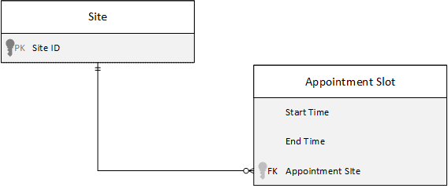
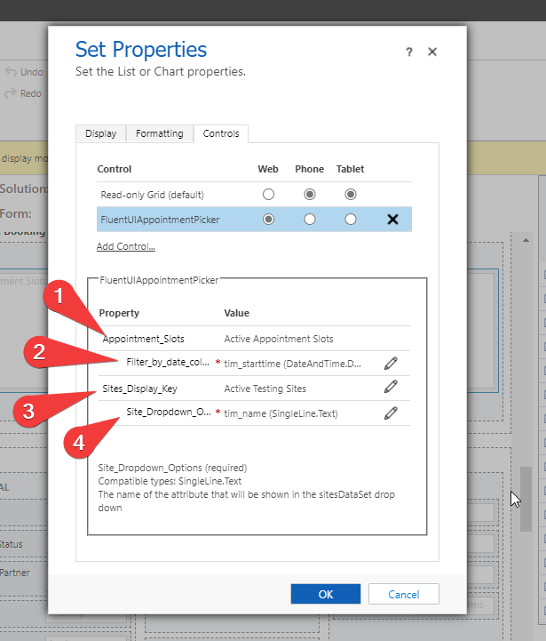

# A Power Apps Component Framework FluentUI Grid

An example PCF component that can be added to a Contact form (or any other entity) and then used to display and perform basic filtering on a data set of appointment slots, and then create a booking record against one of the slots.

A use case could be a contact centre that starts a phone call by identifying the Contact record, and then wants a quick way to make a booking without leaving the Contact form.

The date and site filtering is expected to be relatively generic, however you will need to modify the behaviour of the Book button to perform an action specific to your requirements. If nothing else this project could be used to see how to use FluentUI in a PCF.

This was written mainly as an exercise to learn the Power Apps Component Framework and FluentUI. A lot of inspiration was taken from [Michal Turzynski's Fluent UI DataList project](https://github.com/michal-turzynski/pcf-fluentui-grid)

## Demo: 


## Usage

It is not reccommended to deploy this component 'as-is' because the Book action currently creates an entity which is unlikely to exist in your environment. Follow the Necessary Customisation steps first.

This component assumes you have a data model like this, where bookings are made against an 'Appointment Slot' entity (i.e. a window where bookings can be made) and where each Appointment Slot is linked to a particular Site:



Use this command to build the component: 

`msbuild /p:pcfbuildmode=production`. 

The pcfbuildmode switch is required as otherwise the WebResource files that are generated may be too large to be imported to a CDS environment.

Once the solution has been built and imported, the component should be configured as follows:

1. Add a subgrid to your form and select a view that contains the Date and Site columns that would be filtered on.
2. Selec the 'FluentUIAppointmentPicker' control and configure as follows:



1. The subgrid view
2. The date/datetime column that will be used to filter the list of Appointment Slots using the Date Picker control
3. Another data-set that is used to list the 'Sites' that can be selected
4. The column name from the 'sitesDataSet' that will be used as the display value in the drop down

## Necessary Customisation

Before using this component you must configure 2 items:

### Site Filter Attribute
The name of the lookup attribute that connects Appointment Slot to Site must be updated in index.ts:

```typescript
if (siteIds && siteIds.length > 0) {
            let siteCondition: DataSetInterfaces.ConditionExpression = {
                attributeName: "tim_site", // This needs updating to the attribute name on the gridDataSet that contains the link to the records in sitesDataSet
                conditionOperator: 8, //in
                value: siteIds
            }

            conditionsArray.push(siteCondition);
        }
```

### makeABooking function
The actions performed inside the makeABooking function found in index.ts would need to be updated to something specific to your requirements. This could be creating a custom entity, or a standard Appointment activity.

```typescript
 public makeABooking(context: ComponentFramework.Context<IInputs>, bookingSlotId?:string, ): void {

        // This would have to be amended based on whatever entity was being created
        console.log(`Make a booking for: ${bookingSlotId}`);
        .......
 }
 ```
